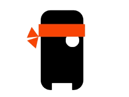

# 🎮 STICK HERO 🎮


## 🔥 Stretch, Release, Conquer! 🔥

**Stick Hero** is an addictive JavaFX game where precision and timing determine your fate! Extend your stick just the right length to bridge the gap between platforms, collect cherries for bonuses, and become the ultimate Stick Hero!

---

## ✨ Epic Features ✨

- 📏 **Perfect Timing Mechanics** - Master the art of stick extension!
- 🏆 **High Score System** - Beat your friends and dominate the leaderboards!
- 🍒 **Power Cherry Collection** - Boost your score by collecting valuable cherries!
- 🌈 **Multiple Game Levels** - Face increasingly challenging gaps and scenarios!
- 💾 **Save/Load Game** - Never lose your progress with our save system!
- ⏸️ **Pause Functionality** - Take a break whenever you need it!
- 🎵 **Immersive Audio** - Enjoy background music and satisfying sound effects!

---

## 🚀 Quick Start Guide 🚀

### Prerequisites

- Java 11+ ☕
- Maven 3.6+ 🛠️

### Installation

1. **Clone the repository:**
```bash
git clone https://github.com/yourusername/StickHero.git
```

2. **Navigate to the game directory:**
```bash
cd StickHero
```

3. **Build with Maven:**
```bash
mvn clean install
```

4. **Launch the game:**
```bash
mvn javafx:run
```

---

## 🎮 Game Controls 🎮

- **Press & Hold** - Extend your stick to cross the gap
- **Release** - Drop your stick and attempt to cross
- **Precision is key!** - If your stick is too short or too long, you'll fall!
- **Collect cherries** - Position your stick perfectly to grab cherries along the way

---

## 🏗️ Code Structure 🏗️

```
StickHero/
├── src/
│   ├── main/
│   │   ├── java/
│   │   │   └── com/
│   │   │       └── stickman/
│   │   │           ├── application/  # Main application & game entry
│   │   │           ├── controller/   # Game controllers & logic
│   │   │           ├── model/        # Game models & data
│   │   │           └── util/         # Utilities & helpers
│   │   └── resources/
│   │       └── com/
│   │           └── stickman/
│   │               ├── fxml/         # UI layout files
│   │               ├── images/       # Game graphics
│   │               └── sounds/       # Music & sound effects
│   └── test/                         # JUnit tests
└── Assets/                           # Original art assets
```

---

## 🧠 Design Patterns Used 🧠

### Memento Pattern
Implemented through serialization to save and restore game state. The perfect way to capture and restore game progress!

### Singleton Pattern
Applied to critical components like the `GameRegistry` to ensure a single point of control throughout the game.

---

## 🛠️ Developer Notes 🛠️

- Built with JavaFX for smooth cross-platform gameplay
- Tests available in `src/test/java/com/stickman` for core functionality verification
- Adjust game difficulty by modifying pillar generation parameters

---

## 📸 Screenshots 📸


*The brave stick hero ready to conquer all challenges!*

---

## 🙏 Acknowledgments 🙏

- Inspired by the classic mobile Stick Hero game
- Special thanks to all the testers who provided valuable feedback
- Built with ❤️ by our amazing development team

---

**Ready to test your reflexes?** Launch the game and see if you have what it takes to become the ultimate Stick Hero!


